# Lightweight C++ Plugin Framework

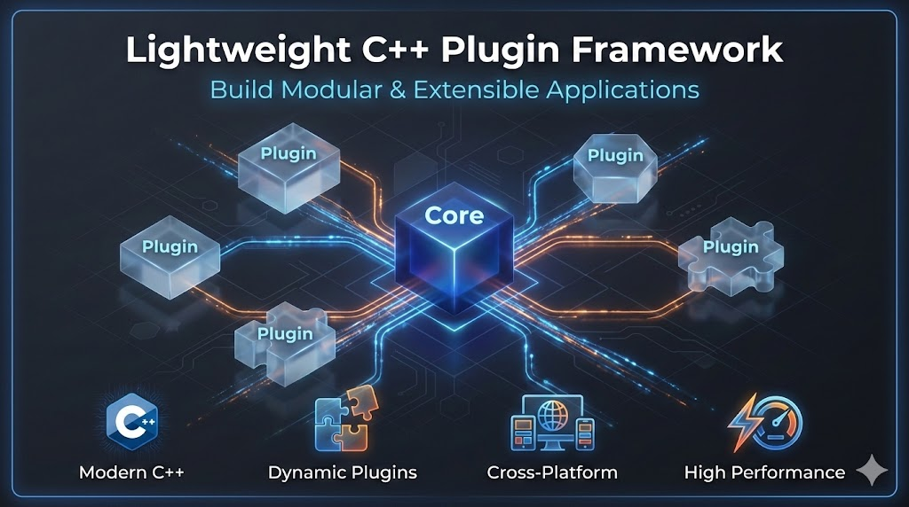

This framework provides a simple yet powerful architecture for building modular C++ applications. It was born from the need for a dependency-light, cross-platform plugin system that avoids the complexity of larger frameworks. The core motivation is to enable true "drop-in" extensibility: new functionality can be added by simply placing a plugin into a folder, with no need to recompile the core application.

The architecture's power is rooted in the separation of interfaces and implementations. A plugin can define an **abstract service**, which acts as a contract or an "extension point" for a certain capability. Other, independent plugins can then provide **concrete service** implementations that fulfill this contract. For example, a core plugin could define an abstract "ImageEffect" service, and then separate plugins could implement "GaussianBlur", "Sharpen", and "Invert" effects. This promotes a highly decoupled system where extension points are clearly defined and independently implemented.

This approach is ideal for a wide range of software, from desktop tools like image editors and digital audio workstations to game engines that require custom behaviors. Looking forward, the design is well-suited for modern deployment scenarios like **WebAssembly (WASM)**. An application compiled to WASM could dynamically load plugins as separate `.wasm` modules, enabling high-performance, extensible web applications where features are loaded on demand.

## Images

| Image | Name | Description |
|-|-|-|
| 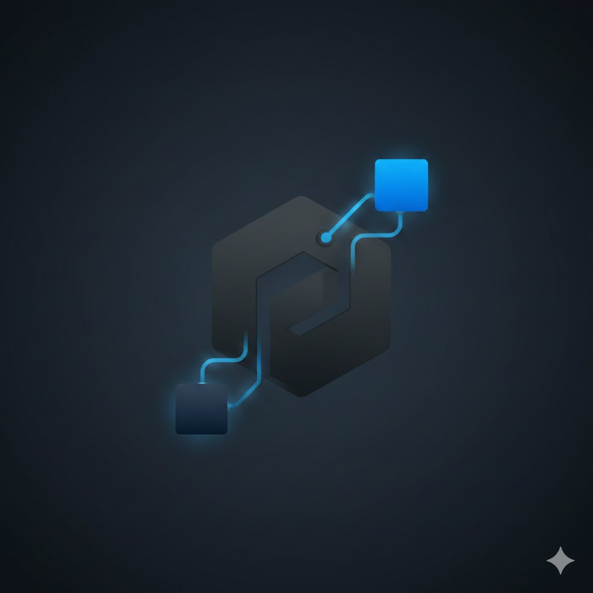 | Logo | The official logo of the Lightweight C++ Plugin Framework. |
| 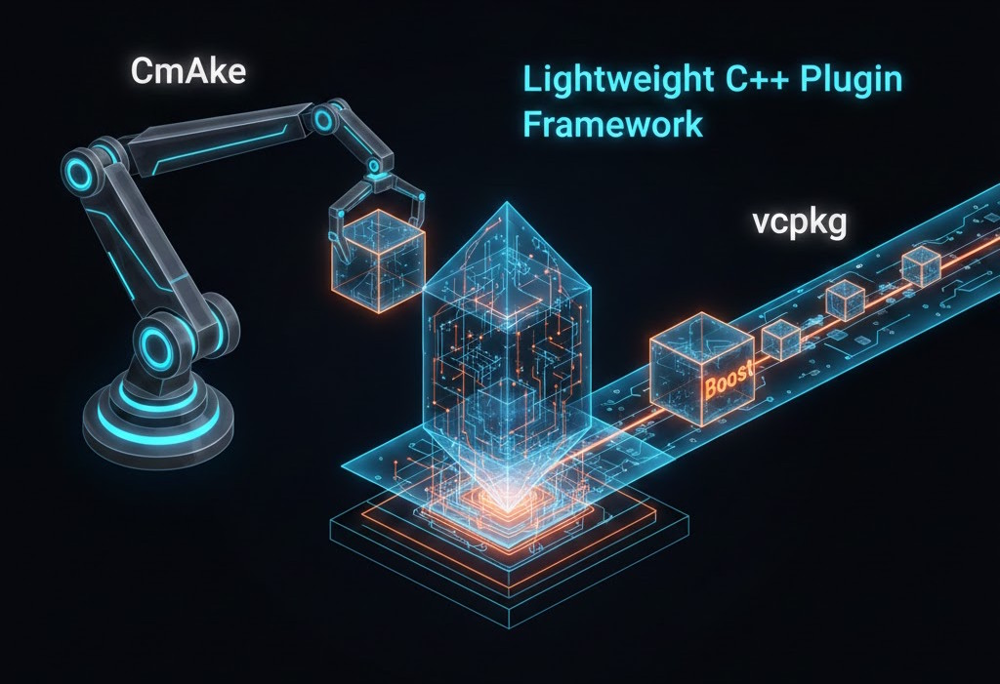 | Dependencies | A diagram showing the framework's core dependencies, such as Boost, CMake, and vcpkg. |
| 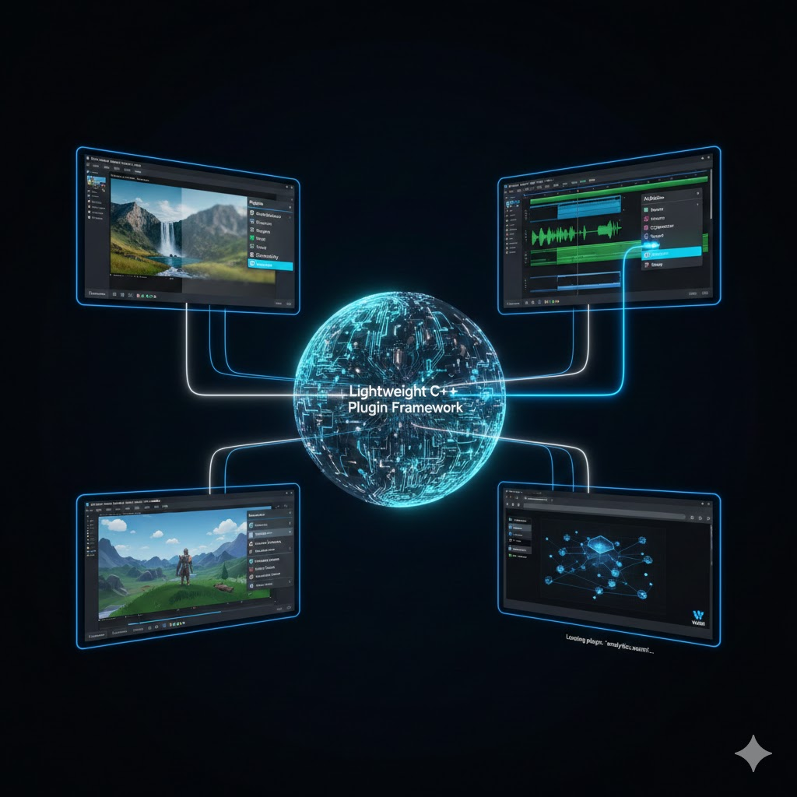 | Applications | An illustration of how multiple, distinct applications can be composed from a common set of plugins. |
| 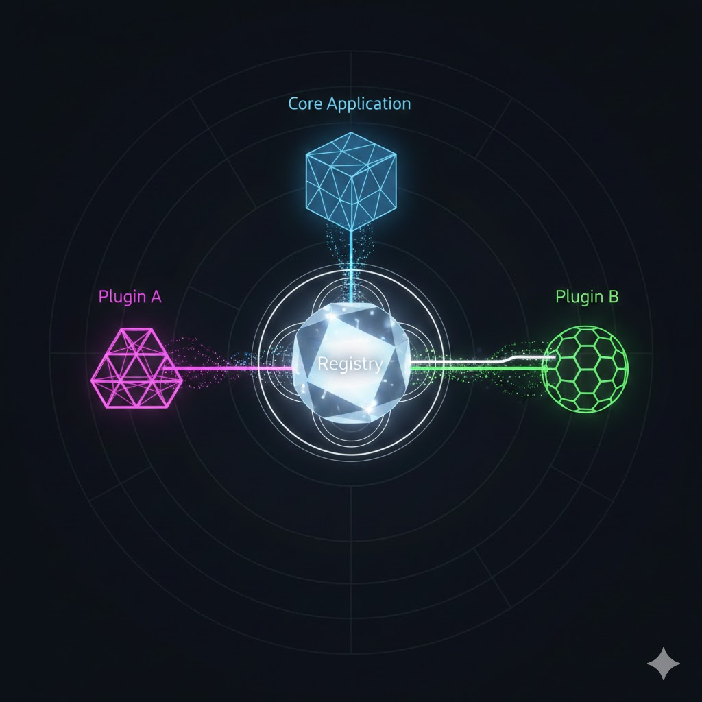 | Registry | Shows the central `Registry` as a hub, managing connections between plugins and the core application. |
| 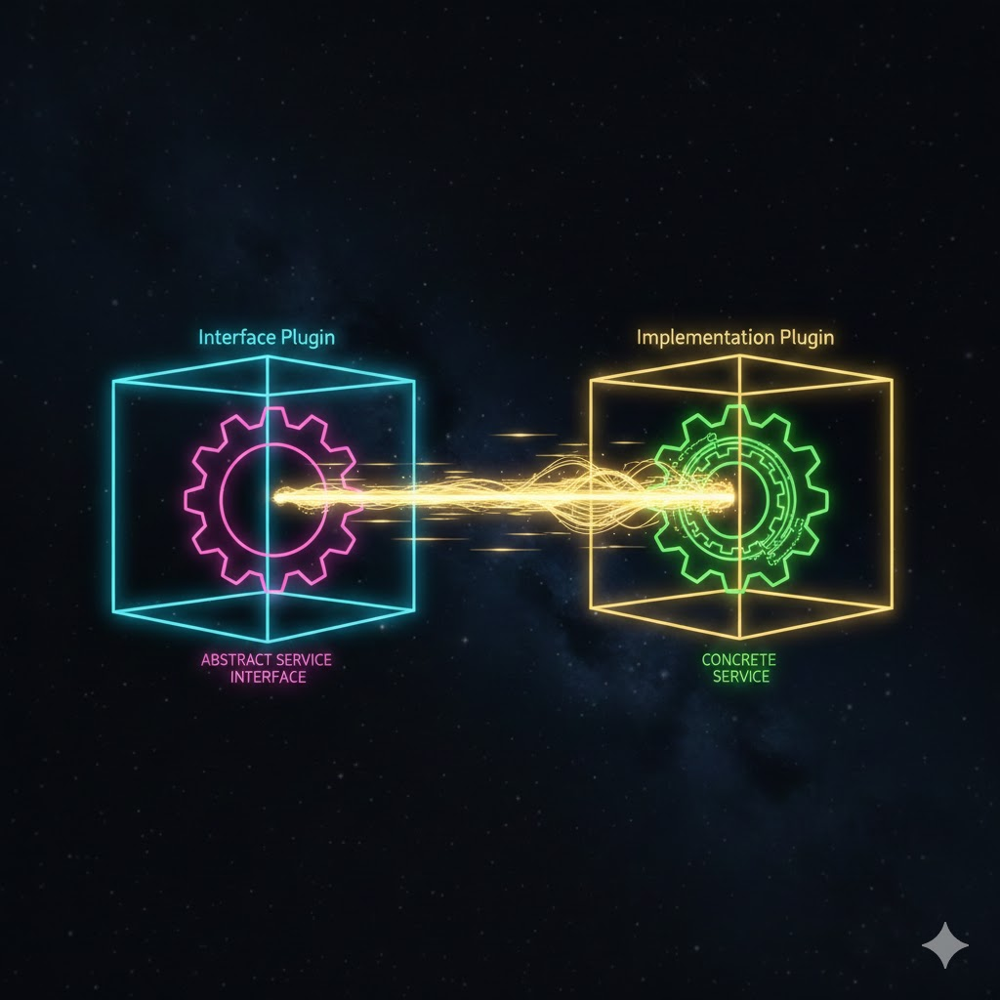 | Services | An abstract representation of a plugin providing a concrete service to fulfill another plugin's abstract interface. |
| 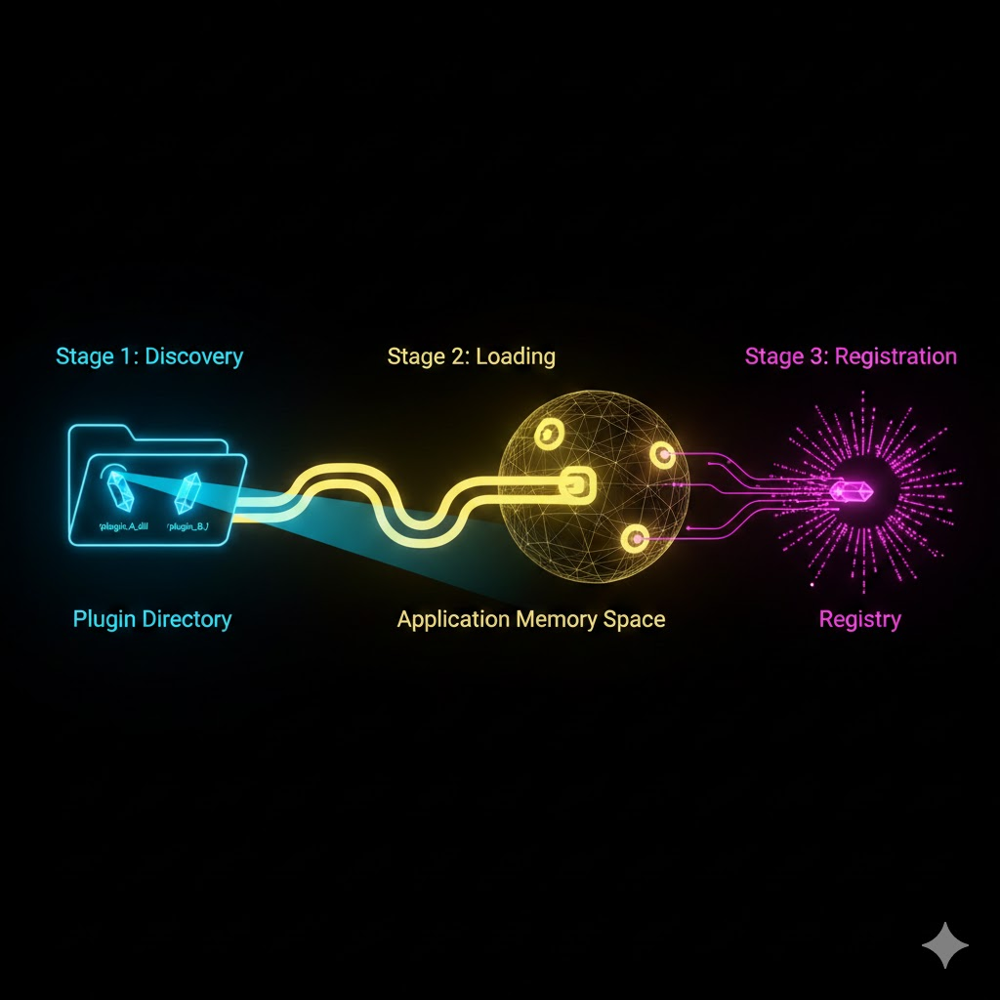 | Lifecycle | Visualizes the runtime lifecycle of a plugin, from discovery and loading to the registration of its services. |
| 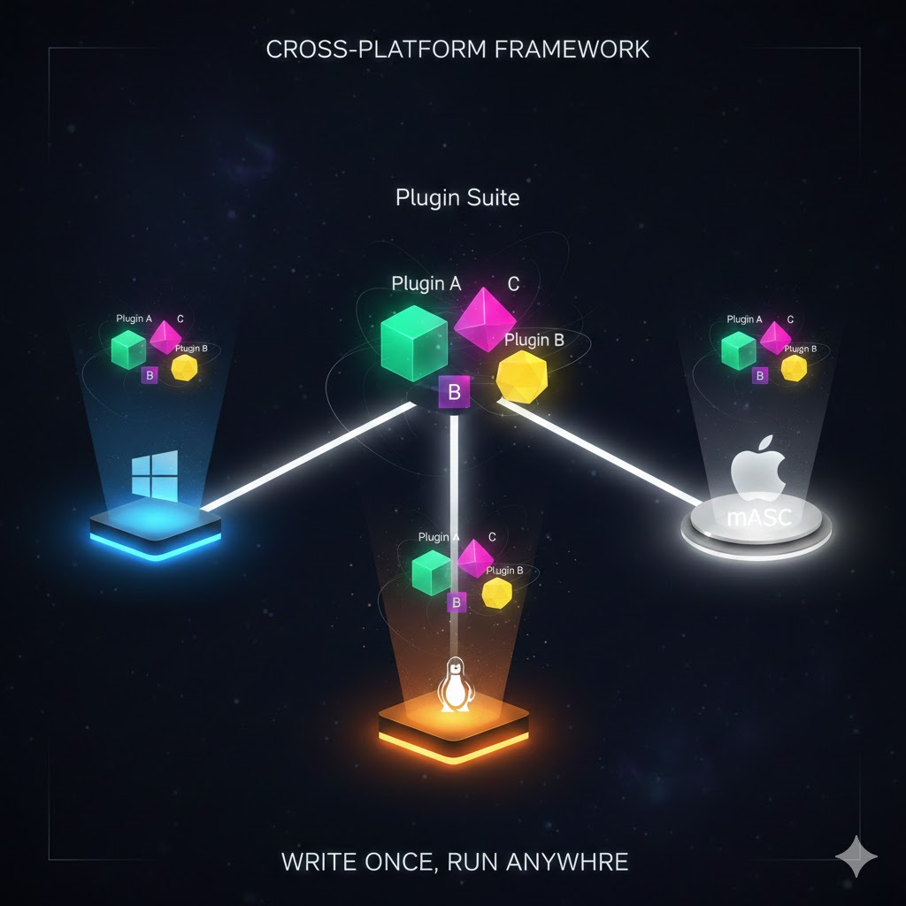 | Cross-Platform | Illustrates the cross-platform nature of the framework, with plugins running uniformly across different operating systems. |
| 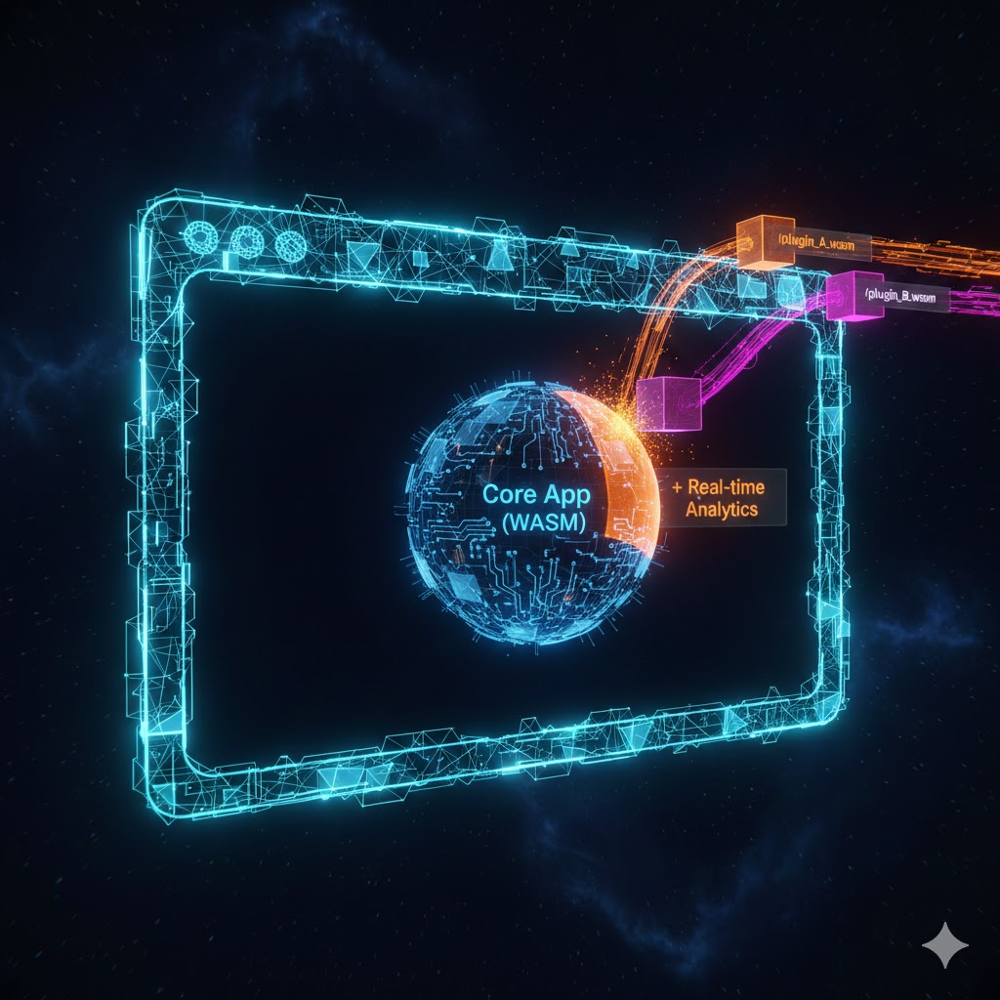 | WebAssembly | Depicts the future-facing goal of WebAssembly deployment, with plugins loading dynamically in a web browser. |

## Dependencies

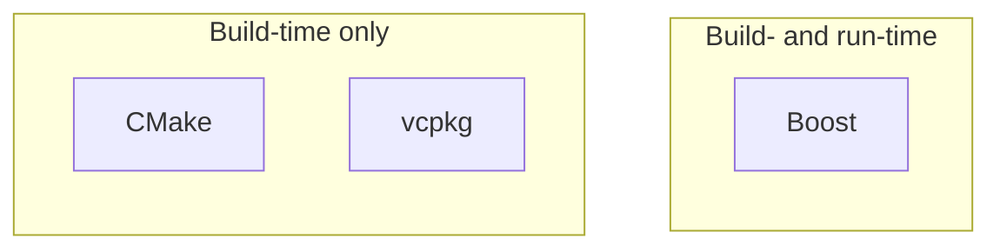

This framework leverages several external libraries to provide its core functionalities. Dependencies are categorized by when they are needed: during compilation (build-time) or when the application is running (run-time).

### Build-time only

These dependencies are crucial for setting up the development environment and compiling the project:

*   **CMake**: The cross-platform build system used to configure and generate the project builds.
*   **vcpkg**: A C++ package manager used to install and manage library dependencies. The required libraries are listed in the `vcpkg.json` file in the root directory.

### Build- and run-time

These libraries are essential both for building the project and for its operation at runtime:

*   **Boost**: A collection of high-quality, peer-reviewed C++ libraries. This framework uses Boost for parsing XML files (with the help of `boost::property_tree`).

## Tutorials

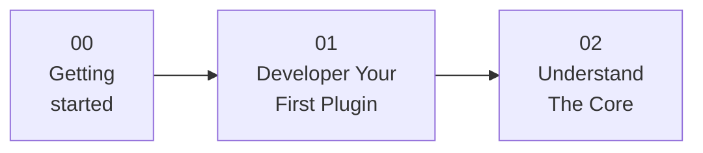

This project includes step-by-step tutorials to help you get started with the framework.

*   **[00 - Getting Started](./Tutorials/00_Getting_Started/README.md)**: This guide walks you through cloning the repository, setting up the development environment on Windows with Visual Studio 2026, and building and running the project for the first time. It covers the automatic dependency installation via vcpkg and how to launch the main application.

*   **[01 - Develop Your First Plugin](./Tutorials/01_Develop_Your_First_Plugin/README.md)**: Learn how to create a new plugin from scratch. This tutorial demonstrates how to build a `MultiplierService` that implements an existing abstract service, configure its build system with CMake, create its manifest file, and integrate it into the main application.

*   **[02 - Understand The Core](./Tutorials/02_Understand_The_Core/README.md)**: Dive into the fundamental components of the framework, understanding the roles of the `Registry`, `Plugin`, `Service`, and `Application` classes and how they interact to provide a robust and extensible architecture.

## Contributing

We welcome contributions! Please see our [CONTRIBUTING.md](CONTRIBUTING.md) for details on how to get started.

## License

This project is licensed under the [MIT License](LICENSE.md).