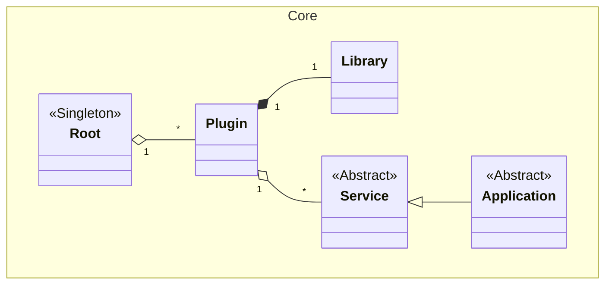

# Lightweight C++ Plugin Framework

This framework provides a simple yet powerful architecture for building modular C++ applications. It allows developers to extend an application's functionality by simply adding new plugins to a designated folder, without needing to recompile the core application.

### Core Components

*   **`Root`**: The central hub of the framework, implemented as a singleton. It is responsible for discovering, loading, and managing all available plugins. The application's entry point will typically interact with the `Root` to initialize the plugin system by pointing it to directories containing plugins.

*   **`Plugin`**: A plugin is a self-contained unit of functionality, consisting of a shared library (e.g., a `.dll` on Windows) and a `Plugin.xml` manifest file. The manifest describes the plugin, including its name, the services it provides, and any dependencies it has on other plugins.

*   **`Service`**: The base class for any functionality exposed by a plugin. Plugins can offer multiple services, and a service is the primary way consumers interact with a plugin's features.

*   **`Application`**: A special type of `Service` that acts as an application's main entry point. It defines an abstract `run` method that implementing plugins can use to start their primary logic.

*   **`Library`**: A utility class that abstracts the platform-specific details of loading and interacting with shared libraries. Each `Plugin` instance manages a `Library` instance to load its code at runtime.

### Architectural Workflow

1.  The main executable initializes the framework by retrieving the `Root` singleton instance.
2.  It calls `Root::addPluginFolder()`, passing a path to a directory where plugins are stored.
3.  The `Root` scans the directory for subdirectories containing a `Plugin.xml` file, creating a `Plugin` instance for each one it finds.
4.  The application can then query the `Root` for a specific plugin by name using `getPlugin()`.
5.  Once a `Plugin` is obtained, the application can request a `Service` from it via `getService()`.
6.  When a service is requested, the `Plugin` ensures its corresponding `Library` (and the libraries of its dependencies) are loaded into memory, and then it instantiates the service and returns a pointer to it.
7.  If the requested service is an `Application`, the main executable can call its `run()` method to transfer control to the plugin's logic.