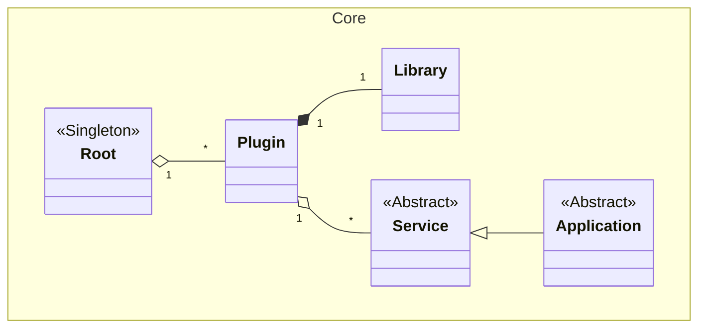

# Lightweight C++ Plugin Framework


This framework provides a simple yet powerful architecture for building modular C++ applications. It allows developers to extend an application's functionality by simply adding new plugins to a designated folder, without needing to recompile the core application.

### Core Components



*   **`Root`**: The central hub of the framework, implemented as a singleton. It is responsible for discovering, loading, and managing all available plugins. The application's entry point will typically interact with the `Root` to initialize the plugin system by pointing it to directories containing plugins.

*   **`Plugin`**: A plugin is a self-contained unit of functionality, consisting of a shared library (e.g., a `.dll` on Windows) and a `Plugin.xml` manifest file. The manifest describes the plugin, including its name, the services it provides, and any dependencies it has on other plugins.

*   **`Service`**: The base class for any functionality exposed by a plugin. Plugins can offer multiple services, and a service is the primary way consumers interact with a plugin's features.

*   **`Application`**: A special type of `Service` that acts as an application's main entry point. It defines an abstract `run` method that implementing plugins can use to start their primary logic.

*   **`Library`**: A utility class that abstracts the platform-specific details of loading and interacting with shared libraries. Each `Plugin` instance manages a `Library` instance to load its code at runtime.

### Architectural Workflow

1.  The main executable initializes the framework by retrieving the `Root` singleton instance.

2.  It calls `Root::addPluginFolder()`, passing a path to a directory where plugins are stored.

3.  The `Root` scans the directory for subdirectories containing a `Plugin.xml` file, creating a `Plugin` instance for each one it finds.

4.  The application can then query the `Root` for a specific plugin by name using `getPlugin()`.

5.  Once a `Plugin` is obtained, the application can request a `Service` from it via `getService()`.

6.  When a service is requested, the `Plugin` ensures its corresponding `Library` (and the libraries of its dependencies) are loaded into memory, and then it instantiates the service and returns a pointer to it.

7.  If the requested service is an `Application`, the main executable can call its `run()` method to transfer control to the plugin's logic.

### Plugin Development

Developing a custom plugin involves creating a shared library that contains your logic and a manifest file that describes it to the framework. The `Sources/Plugins` directory contains two examples: `DummyApplication` and `DummyService`, which demonstrate the key concepts.

#### 1. The Plugin Manifest (`Plugin.xml`)

Every plugin must have a `Plugin.xml` file in its root directory. This file defines the plugin's name, the services it provides, and any dependencies it has.

*   **Service Declaration**: The `<Services>` tag contains one or more `<Service>` entries.

    *   `name`: The name of the service class within your plugin's namespace.

    *   `extends`: (Optional) The fully qualified name of a service from another plugin that this service inherits from. This is how you implement an interface or extend a base class defined in another plugin.

    *   `type="abstract"`: (Optional) Marks a service as an abstract interface that other plugins can implement. The framework will not try to instantiate an abstract service.

*   **Dependencies**: If your plugin uses services from another plugin, you must declare it in the `<Dependencies>` section.

**Example: `DummyApplication/Plugin.xml`**

This plugin defines an `Application` service (the entry point) and an abstract `Service` interface.

```xml
<Plugin name="Plugins::DummyApplication">
  <Services>
    <Service name="Application" extends="Core::Application"/>
    <Service name="Service" type="abstract"/>
  </Services>
</Plugin>
```

**Example: `DummyService/Plugin.xml`**

This plugin provides a concrete implementation for the abstract service in `DummyApplication` and declares a dependency on it.

```xml
<Plugin name="Plugins::DummyService">
  <Services>
    <Service name="Service" extends="Plugins::DummyApplication::Service"/>
  </Services>
  <Dependencies>
    <Dependency plugin="Plugins::DummyApplication"/>
  </Dependencies>
</Plugin>
```

#### 2. Defining and Implementing Services

Services are C++ classes that inherit from `Core::Service` (or a subclass).

*   **Abstract Service (Interface)**: A plugin can export an abstract class with pure virtual methods. Other plugins can then provide concrete implementations. `DummyApplication` does this with its `Service` class.

    *Source: `Plugins/DummyApplication/Service.h`*

    ```cpp
    class PLUGINS_DUMMYAPPLICATION_API Service : public Core::Service
    {

    public:

        virtual int calculate(int a, int b) = 0; // Pure virtual function

    };
    ```

*   **Concrete Service (Implementation)**: `DummyService` implements the `calculate` method.

    *Source: `Plugins/DummyService/Service.cpp`*

    ```cpp
    #include "Service.h"

    using namespace Plugins::DummyService;

    int Service::calculate(int a, int b)
    {

        return a + b;

    }
    ```

#### 3. Service Registration

To make your service class available to the framework, you must register it. This is typically done in a `main.cpp` file within your plugin. The `DECLARE_SERICE_REGISTRY` macro handles the boilerplate of creating the necessary factory function that the framework calls to instantiate your service.

*Source: `Plugins/DummyService/main.cpp`*

```cpp
#include "Service.h"
#include <Core/Registry.h>

using namespace Plugins::DummyService;

typedef Core::Registry<Service> Registry;

DECLARE_SERICE_REGISTRY(Registry)
```

#### 4. Exporting Symbols

For the core application to be able to access your plugin's classes and functions, you must export them from the shared library. A common pattern is to use a `Build.h` file with preprocessor macros.

*Source: `Plugins/DummyService/Build.h`*

```cpp
#ifdef Plugins_DummyService_EXPORTS
#	define PLUGINS_DUMMYSERVICE_API CORE_EXPORT
#else
#	define PLUGINS_DUMMYSERVICE_API CORE_IMPORT
#endif
```

You then apply the `PLUGINS_DUMMYSERVICE_API` macro to the classes you want to export.

#### 5. Build System (`CMakeLists.txt`)

Finally, your `CMakeLists.txt` needs to define the shared library and link it against the `Core` framework and any other plugin dependencies.

*Source: `Plugins/DummyService/CMakeLists.txt`*

```cmake
add_library(Plugins_DummyService SHARED
	Build.h
	Namespace.h
	main.cpp
	Service.h
	Service.cpp)

# Link against the core framework
target_link_libraries(Plugins_DummyService Core)

# Link against the plugin it depends on
target_link_libraries(Plugins_DummyService Plugins_DummyApplication)

# Copy the manifest to the build directory
configure_file(Plugin.xml Plugin.xml)
```
