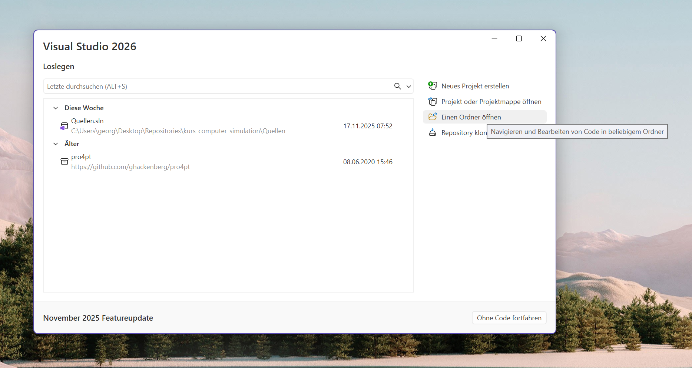
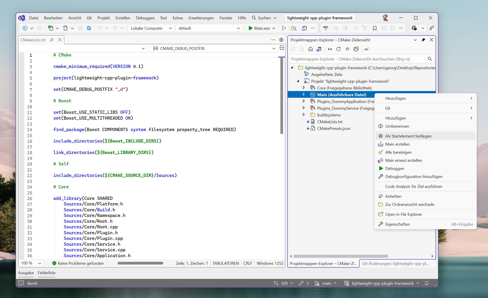

# Tutorial 01: Getting Started (on Windows with Visual Studio 2026)

This tutorial will guide you through setting up, building, and running the Lightweight C++ Plugin Framework project on a Windows machine using Visual Studio 2026.

The easiest way to get started is by using Visual Studio's built-in CMake and vcpkg integration, which automates most of the setup process.

## 1. Prerequisites

Before you begin, ensure you have the following installed:

*   **Visual Studio 2026**: Make sure the **"Desktop development with C++"** workload is installed. This includes the necessary C++ toolchain, CMake, and other essential tools.
*   **Git**: The version control system used to clone the repository. You can download it from [git-scm.com](https://git-scm.com/).

## 2. Clone the Repository

First, clone the project repository to your local machine. Open a terminal (like Command Prompt, PowerShell, or Windows Terminal) and run the following command:

```bash
git clone https://github.com/Looking-for-a-Job/lightweight-cpp-plugin-framework.git
cd lightweight-cpp-plugin-framework
```

## 3. Building and Running with Visual Studio

### Step 3.1: Open the Project Folder

Launch Visual Studio 2026. Instead of creating or opening a solution file, use the "Open a local folder" option on the start screen, or go to `File > Open > Folder...` and select the `lightweight-cpp-plugin-framework` directory you just cloned.



Once opened, Visual Studio will automatically detect the `CMakeLists.txt` file and begin configuring the project.

### Step 3.2: Automatic Dependency Installation

The project is configured with a `vcpkg.json` file, which lists all required C++ libraries (like Boost). Visual Studio's CMake integration will automatically detect this file and:

1.  Set up a local instance of the vcpkg package manager within your project's build directory.
2.  Download and build the required dependencies.

This process may take several minutes. You can monitor the progress in the **Output** window. Wait for a message indicating that CMake generation has finished.

### Step 3.3: Build the Project

After CMake has finished configuring the project and vcpkg has installed the dependencies, you can build everything.

Go to the main menu and select **Build > Build All** (or use the shortcut `Ctrl+Shift+B`).

This will compile the core framework, all plugins, and the main executable.

### Step 3.4: Run the Application

The final step is to run the application's entry point.

1.  In the **Solution Explorer**, Visual Studio should be in "CMake Targets View". If not, use the "Views" dropdown at the top of the Solution Explorer to switch to it.
2.  Find the `Main` project, and within it, the executable **`Main.exe`**.
3.  Right-click on `Main.exe` and select **"Set as Startup Item"**.



Now, press **F5** or click the green "Run" button with `Main.exe` selected in the toolbar.

A console window will appear, and you should see the following output from the `DummyApplicationCli` plugin, which confirms that the core application successfully loaded a plugin and its dependencies:

```
Dienstimplementierung Plugins::DummyService::Service
calculate(1, 1) = 2
Hello world!
```

You have now successfully built and run the application! You can start exploring the code and developing your own plugins.
