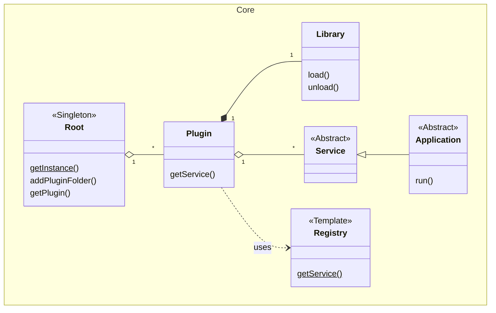

# Tutorial: Understand The Core

Welcome to the deep dive into the heart of the **lightweight-cpp-plugin-framework**. This tutorial will walk you through the core components, their responsibilities, and how they work together to create a flexible and extensible application.

The framework is designed around a central idea: **decoupling**. The main application should not need to know the concrete details of its plugins. It should only interact with them through well-defined interfaces called **Services**. This allows you to add, remove, or update features (plugins) without ever recompiling the core application.

## Classes

The core logic resides in the `Sources/Core` directory. Let's break down the most important classes. It's important to note the distinction between `Root`, which is the main run-time registry, and `Registry`, which is a compile-time helper used inside each plugin.



*   **`Root`**: The central **run-time registry** and plugin manager for the framework, implemented as a singleton. It is responsible for discovering, loading, and managing all available plugins (`Plugin` objects). It acts as the main service locator for the application.

*   **`Plugin`**: A plugin is a self-contained unit of functionality, consisting of a shared library (e.g., a `.dll` on Windows) and a `Plugin.xml` manifest file. The `Plugin` class parses this manifest and manages the lifecycle of the shared library. It is responsible for calling the factory function inside the library to create service instances.

*   **`Service`**: The base class for any functionality exposed by a plugin. Plugins can offer multiple services, and a service is the primary way consumers interact with a plugin's features.

*   **`Application`**: A special type of `Service` that acts as an application's main entry point. It defines an abstract `run` method that implementing plugins can use to start their primary logic.

*   **`Library`**: A utility class that abstracts the platform-specific details of loading and interacting with shared libraries. Each `Plugin` instance manages a `Library` instance to load its code at runtime.

*   **`Registry` (in `Registry.h`)**: This is a **compile-time, template-based helper** used *within* a plugin to create a factory for its services. By chaining services in the template parameters (e.g., `Core::Registry<ServiceA, Core::Registry<ServiceB>>`), it generates a static `getService` method. The `DECLARE_SERVICE_REGISTRY` macro then exports this method as a C-style function, which the `Plugin` class calls to instantiate services.

## Workflow

Here is the detailed sequence of events when an application using this framework starts up and uses a plugin:

1.  **Initialization**: The main executable initializes the framework by retrieving the `Root` singleton instance.

2.  **Plugin Discovery**: It calls `Root::addPluginFolder()`, passing a path to a directory where plugins are stored.

3.  **Plugin Parsing**: The `Root` scans the directory for subdirectories containing a `Plugin.xml` file. For each one it finds, it creates a `Plugin` instance, which parses the XML manifest to learn about the plugin's name, services, and dependencies.

4.  **Service Request**: The application queries the `Root` for a specific plugin by name (e.g., `root->getPlugin("Plugins::DummyService")`) and then requests a service from it (e.g., `plugin->getService("Service")`).

5.  **Library Loading**: The first time a service is requested from a `Plugin`, the `Plugin` object ensures its dependencies are loaded. Then, it uses its internal `Library` instance to load the plugin's own shared library (`.dll` or `.so`) into memory.

6.  **Factory Function Lookup**: The `Plugin` class looks for an exported C-style function named `getService` inside the loaded library. This function is the factory that knows how to create all the services offered by this plugin.

7.  **Service Instantiation**: The `Plugin` calls this `getService` function, passing the name of the requested service. The factory function—which was generated at compile-time by the `Core::Registry` template and `DECLARE_SERVICE_REGISTRY` macro—instantiates the correct service and returns a pointer to it.
    ```cpp
    // In Plugins/DummyService/main.cpp
    // This creates the service factory for the plugin.
    typedef Core::Registry<Service> Registry;

    // This exports the factory as a 'getService' C function.
    DECLARE_SERVICE_REGISTRY(Registry)
    ```

8.  **Control Transfer**: The `Plugin` returns the `ServicePtr` to the application. If the requested service is an `Application`, the main executable can now call its `run()` method to transfer control to the plugin's logic.